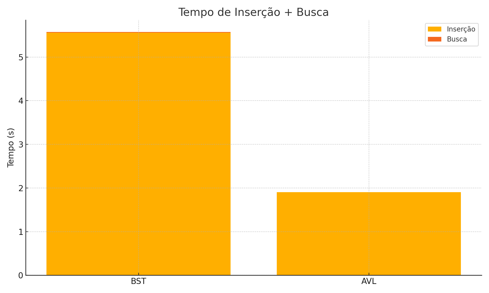
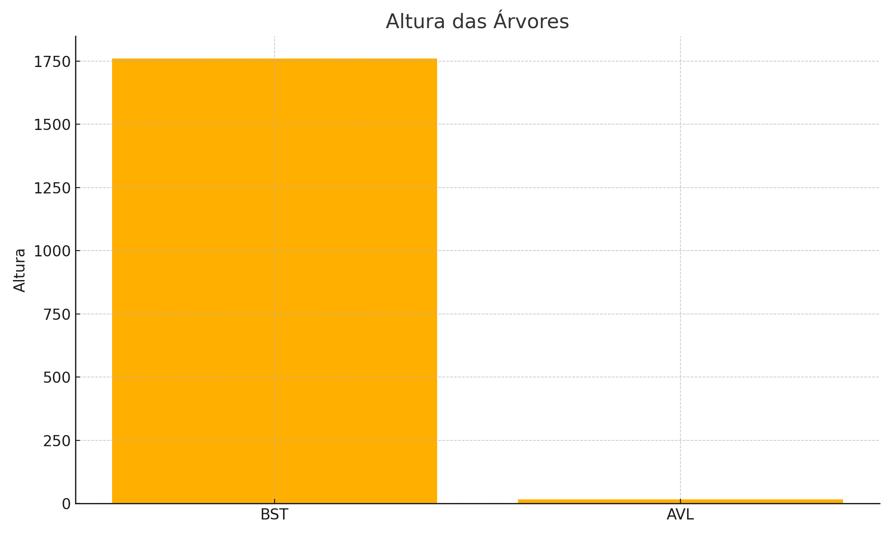

# Projeto: Estrutura de Dados com Árvores Binária de Busca (BST) e AVL

Este projeto tem como objetivo implementar, comparar e analisar o desempenho das estruturas de dados **Árvore Binária de Busca (BST)** e **Árvore AVL**, utilizando a base pública `dados_abertos_ogu_2024122.csv`. A comparação envolve o tempo de inserção, tempo de busca e a altura das árvores geradas.

---

## 🔍 Base de Dados

A base utilizada é composta por **18.532 registros únicos** de operações governamentais, identificadas pela coluna `cod_operacao`, utilizada como **chave** para a construção das árvores.

- Total de elementos únicos: `18.532`
- Coluna utilizada como chave: `cod_operacao`
- Arquivo: `dados_abertos_ogu_2024122.csv`

---

## ⚙️ Implementação

Foram implementadas duas estruturas:
- `BST` (Árvore Binária de Busca comum, sem balanceamento)
- `AVLTree` (Árvore Binária de Busca auto-balanceada)

A linguagem utilizada foi **Python**, e as árvores foram construídas com classes personalizadas que suportam inserção, busca e cálculo de altura.

---

## 📊 Resultados Comparativos

| Métrica                 | BST        | AVL        |
|-------------------------|------------|------------|
| Elementos inseridos     | 18.532     | 18.532     |
| Tempo de inserção       | 5.55 s     | 1.90 s     |
| Tempo de busca (100)    | 0.016 s    | 0.000 s    |
| Altura da árvore        | 1761       | 17         |

---

### 📈 Gráficos

#### Tempo de Inserção + Busca

#### Altura das Árvores

---

## 📚 Documentação Técnica

### i) Método

- **Equipamento Utilizado:**  
  Notebook com processador Intel Core i5 e 16GB de RAM.

- **Massa de Dados:**  
  Arquivo `dados_abertos_ogu_2024122.csv`, contendo 18.532 registros únicos.

- **Chave Utilizada:**  
  `cod_operacao` – um identificador textual de cada operação.

- **Algoritmos Utilizados:**  
  - Árvore Binária de Busca (BST)
  - Árvore AVL (balanceada automaticamente)

- **Linguagem de Programação:**  
  Python 3.11  
  Bibliotecas: `pandas`, `matplotlib`, `time`, `random`

---

### ii) Gráficos de Comparação de Tempos de Busca

Os gráficos apresentados mostram claramente a superioridade da AVL em termos de altura e tempo de execução.

---

### iii) Análise Crítica da Eficiência

- A AVL foi mais eficiente em **tempo de busca** e **estrutura balanceada**.
- A BST apresentou comportamento próximo ao **pior caso** com altura de 1761, prejudicando buscas.
- A AVL manteve altura próxima a `log₂(18532) ≈ 14.2`.

---

### iv) Análise Assintótica vs Tempos Obtidos

| Estrutura | Complexidade Inserção | Complexidade Busca | Tempo Real de Busca |
|-----------|------------------------|---------------------|----------------------|
| **BST**   | O(log n) média / O(n) pior caso | O(log n) média / O(n) pior caso | 0.0167 s |
| **AVL**   | O(log n)               | O(log n)            | 0.0000 s |

---

### v) Discussão: Alterando a Chave de Busca

Caso a chave utilizada não fosse `cod_operacao`, mas sim:

- `orgao_superior`: exigiria tratamento de valores repetidos.
- `valor_pago`: possível desbalanceamento com dados ordenados.
- `funcao`: ideal para agrupamentos e análise temática.

Cada tipo de dado afetaria diretamente:
- A **ordenação interna** das árvores
- O **balanceamento natural**
- A **eficiência na busca**

Conclusão: **a escolha da chave é decisiva** para a performance das estruturas de dados.

---

## 🛠️ Ambiente e Execução

- **Linguagem:** Python 3.11
- **Bibliotecas:** pandas, matplotlib
- **Ambiente de teste:** CPU AMD Ryzen 7 2700, 32GB RAM
- **Execução local com arquivo `.csv` contendo os dados**

---
